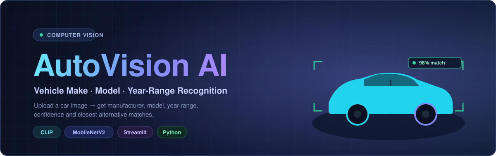
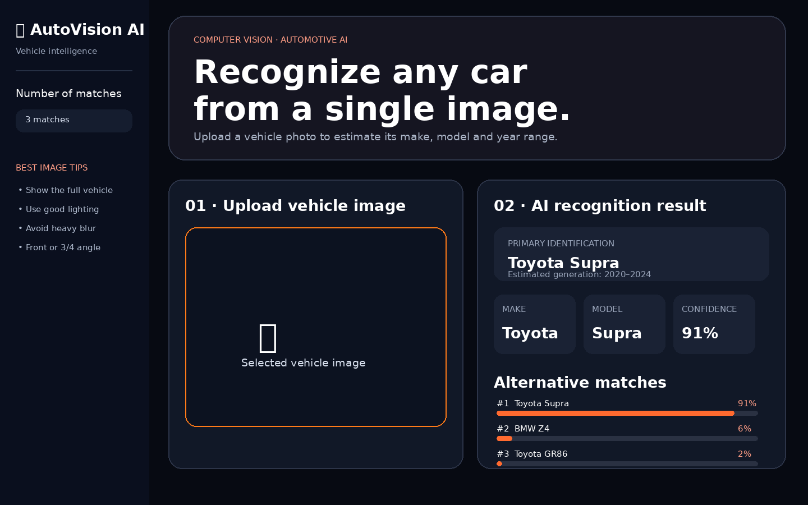
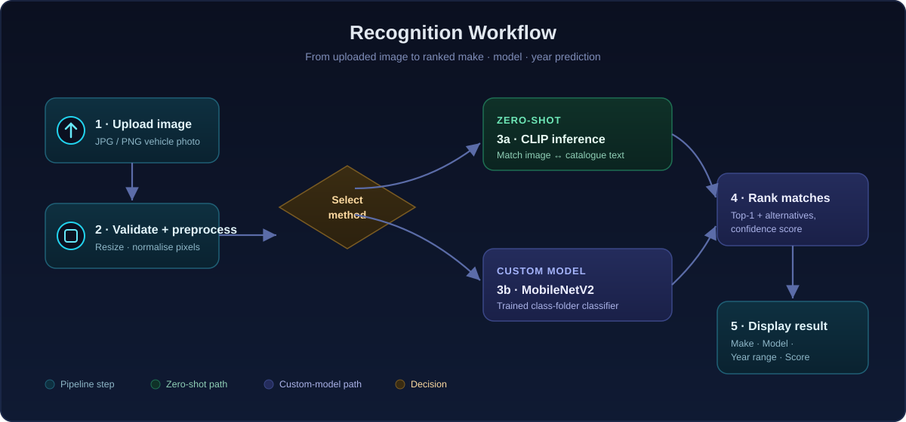
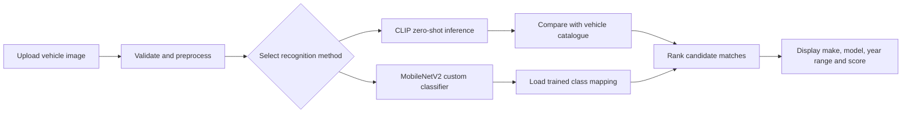
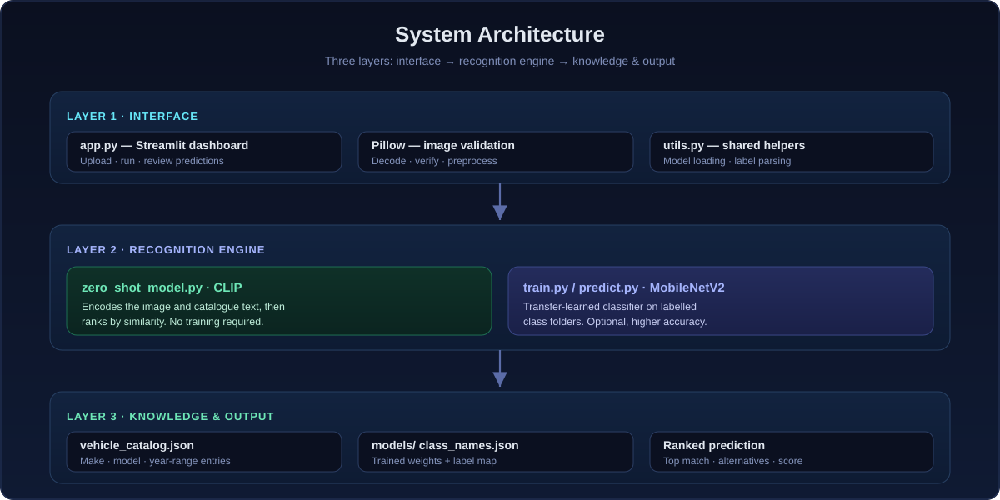

<!-- ======================= HERO ======================= -->
<div align="center">



<br/>

<!-- Badges -->
<p>
  
  
  
  
  
  
  
</p>

<h3>🚗 Machine-Learning Vehicle Make · Model · Year-Range Recognition</h3>

<p><i>Upload a vehicle image and receive its predicted manufacturer, model,<br/>
approximate production-year range, confidence score, and closest alternative matches.</i></p>

<a href="#-quick-start"><b>Quick Start</b></a> ·
<a href="#-recognition-workflow"><b>How it Works</b></a> ·
<a href="#️-system-architecture"><b>Architecture</b></a> ·
<a href="#️-train-a-custom-mobilenetv2-model"><b>Train</b></a> ·
<a href="#️-roadmap"><b>Roadmap</b></a>

</div>

---

## 📌 Overview

**AutoVision AI** is a computer-vision application for recognising vehicles from uploaded images. The working dashboard uses a pretrained **CLIP** image-text model to compare an uploaded vehicle against descriptions stored in `vehicle_catalog.json`. An optional **MobileNetV2** transfer-learning pipeline lets you train a custom classifier on your own labelled images.

<table>
<tr>
<td width="33%" valign="top">

### 🎯 What you get
- Predicted **manufacturer**
- Predicted **model**
- Approximate **year range**
- **Confidence** score
- Closest **alternatives**

</td>
<td width="33%" valign="top">

### ⚡ Two engines
- **CLIP zero-shot** — runs instantly, no training
- **MobileNetV2** — custom-trained, higher accuracy on your classes

</td>
<td width="33%" valign="top">

### 🖥️ One dashboard
- Browser-based **Streamlit** UI
- Image preview + status
- Ranked results + scores

</td>
</tr>
</table>

> [!IMPORTANT]
> The application estimates a **year range**, not an exact production year. Vehicles from the same generation can look almost identical across several years.

---

## 🖥️ Dashboard Interface

<div align="center">



<br/>
<sub>The Streamlit interface lets users upload a vehicle image, run recognition, and review ranked prediction results.</sub>

</div>

---

## ✨ Main Features

<table>
<tr>
<td width="50%" valign="top">

**📤 Vehicle image upload**
<br/><sub>Accepts JPG, JPEG, PNG and Pillow-compatible formats.</sub>

**🚘 Manufacturer prediction**
<br/><sub>Returns the most likely vehicle manufacturer.</sub>

**🏎️ Model prediction**
<br/><sub>Closest match from the catalogue or trained classes.</sub>

**📅 Year-range estimation**
<br/><sub>Approximate generation window for the prediction.</sub>

**📊 Confidence score**
<br/><sub>Relative model score for the top prediction.</sub>

</td>
<td width="50%" valign="top">

**🔍 Alternative matches**
<br/><sub>Ranks additional likely vehicles.</sub>

**⚡ CLIP zero-shot mode**
<br/><sub>Works with no custom-trained dataset.</sub>

**🧠 MobileNetV2 training**
<br/><sub>Transfer learning from labelled class folders.</sub>

**🖥️ Streamlit dashboard**
<br/><sub>Responsive, browser-based interface.</sub>

**📚 Expandable catalogue**
<br/><sub>Add new zero-shot vehicles through JSON.</sub>

</td>
</tr>
</table>

---

## 🔄 Recognition Workflow

<div align="center">

</div>



<table>
<tr>
<td width="50%" valign="top">

### 🟢 CLIP zero-shot recognition
The uploaded image is encoded by a pretrained CLIP model. AutoVision AI builds text descriptions from `vehicle_catalog.json`, compares the image representation against them, and ranks the closest matches.

**Best for**
- Running the project immediately
- Demoing the full application flow
- Adding vehicles without retraining
- Testing before collecting a dataset

</td>
<td width="50%" valign="top">

### 🟣 MobileNetV2 custom training
The optional pipeline uses MobileNetV2 (pretrained on ImageNet) as a feature extractor. A new classification head is trained on folders of labelled images.

**Class-name format**
```
Toyota__Supra__2020-2024
   │        │        └── YearRange
   │        └────────── Model
   └─────────────────── Manufacturer
```

</td>
</tr>
</table>

---

## 🏗️ System Architecture

<div align="center">

</div>

| Layer | Components | Responsibility |
| :--- | :--- | :--- |
| **1 · Interface** | `app.py`, `Pillow`, `utils.py` | Upload, validate/preprocess images, load models |
| **2 · Engine** | `zero_shot_model.py` (CLIP), `train.py` / `predict.py` (MobileNetV2) | Run inference via either recognition path |
| **3 · Knowledge & Output** | `vehicle_catalog.json`, `models/`, ranked result | Store vehicle metadata, produce final prediction |

---

## 📁 Project Structure

```
Car-Model-Predictor/
├── app.py                       # Streamlit dashboard
├── zero_shot_model.py           # CLIP zero-shot recognition
├── train.py                     # MobileNetV2 training pipeline
├── predict.py                   # Command-line custom-model prediction
├── utils.py                     # Shared model and parsing utilities
├── vehicle_catalog.json         # Zero-shot vehicle catalogue
├── requirements.txt             # Python dependencies
├── .github/workflows/ci.yml     # Syntax + catalogue CI checks
├── .gitignore
├── LICENSE
├── README.md
│
├── assets/                      # Banner, dashboard, diagrams
├── data/train/                  # Labelled custom-training images
├── models/                      # Saved model + class_names.json (after training)
├── sample_images/               # Images used for local testing
└── tests/                       # Lightweight validation tests
```

> [!NOTE]
> The files inside `models/` are created after custom training. Zero-shot mode does not require them.

---

## 🚀 Quick Start

```bash
# 1 · Clone
git clone https://github.com/Hruthvik2804/Car-Model-Predictor-.git
cd Car-Model-Predictor-

# 2 · Create + activate a virtual environment
python -m venv .venv
source .venv/bin/activate            # macOS / Linux
# .venv\Scripts\Activate.ps1         # Windows PowerShell
# .venv\Scripts\activate             # Windows CMD

# 3 · Install dependencies
python -m pip install --upgrade pip
pip install -r requirements.txt

# 4 · Launch
streamlit run app.py
```

Then open the local URL shown in the terminal, normally **http://localhost:8501**.

> [!TIP]
> On the first CLIP launch, model files are downloaded and cached, so the first run takes longer than later runs.

---

## 🖼️ Using the Dashboard

1. Start the Streamlit application and open the local URL.
2. Select the available recognition mode.
3. Upload **one clear vehicle image**.
4. Wait for the image and text embeddings to be processed.
5. Review the top prediction, alternatives, and confidence values.

<table>
<tr>
<td width="50%" valign="top">

### ✅ For best results
- One clearly visible vehicle
- Front, side, or three-quarter view
- Good lighting
- Vehicle large within the frame

</td>
<td width="50%" valign="top">

### ⛔ Avoid
- Heavy blur or obstructions
- Multiple vehicles in one image
- Extreme angles or reflections
- Very low resolution

</td>
</tr>
</table>

---

## 🏋️ Train a Custom MobileNetV2 Model

**1 · Prepare the dataset** — one folder per vehicle class inside `data/train`:

```
data/train/
├── Toyota__Supra__2020-2024/
│   ├── image_001.jpg
│   └── image_002.jpg
├── BMW__X5__2019-2023/
│   ├── image_001.jpg
│   └── image_002.jpg
└── Tesla__Model-3__2021-2023/
    ├── image_001.jpg
    └── image_002.jpg
```

Folder format: **`Manufacturer__Model__StartYear-EndYear`**. Include varied angles, colours, backgrounds, distances, lighting, and indoor/outdoor scenes.

> [!TIP]
> For an initial experiment, use at least **100–300 varied images per class**. More diverse, balanced datasets give more reliable results.

**2 · Run training**

```bash
python train.py --data data/train --epochs 15
```

The model and class-name mapping are saved inside `models/`.

---

## 🔎 Run Custom-Model Prediction

```bash
python predict.py --image sample_images/car.jpg
```

> [!NOTE]
> This uses the trained MobileNetV2 model. Make sure the generated files exist inside `models/`.

---

## 🚙 Add More Zero-Shot Vehicles

Open `vehicle_catalog.json` and add an entry:

```json
{
  "manufacturer": "Toyota",
  "model": "Supra",
  "year_range": "2020-2024"
}
```

> Use accurate model names and generation ranges. Adding an entry makes a vehicle a candidate but doesn't guarantee visual separation from very similar models.

---

## 🛠️ Technology Stack

| Technology | Purpose |
| :--- | :--- |
| **Python** | Application and machine-learning logic |
| **Streamlit** | Interactive browser dashboard |
| **Pillow** | Image loading and validation |
| **NumPy** | Numerical processing |
| **Transformers** | CLIP processor and model integration |
| **PyTorch** | CLIP inference backend |
| **TensorFlow** | Custom-model training and inference |
| **MobileNetV2** | Transfer-learning feature extractor |
| **Matplotlib** | Training visualisation support |
| **JSON** | Vehicle catalogue and class metadata |

---

## ⚠️ Current Limitations

AutoVision AI is a machine-learning prototype. Prediction quality may be affected by vehicles outside the catalogue/training data, visually similar generations, low-resolution images, strong reflections or poor lighting, unusual angles, modified body panels, partial visibility, multiple vehicles in one image, or overly broad catalogue descriptions.

> [!WARNING]
> The zero-shot score reflects **relative similarity** between the image and configured descriptions. It is not verified proof of a vehicle's identity, trim, or exact year.

---

## 🗺️ Roadmap

- [ ] Automatic vehicle detection and cropping
- [ ] Expand the vehicle catalogue
- [ ] Fine-tune on a specialised vehicle dataset
- [ ] Separate make / model / generation outputs
- [ ] Grad-CAM or attention visualisation
- [ ] Real-time webcam recognition
- [ ] Vehicle colour and body-type prediction
- [ ] FastAPI inference service
- [ ] Docker support
- [x] Unit and integration tests
- [ ] Prediction history + downloadable reports
- [ ] Public demo deployment

---

## 🤝 Contributing

Contributions are welcome:

1. Fork the repository
2. Create a feature branch
3. Make and test your changes
4. Commit with a descriptive message
5. Push and open a pull request explaining the improvement

See [`CONTRIBUTING.md`](CONTRIBUTING.md) for details.

---

## 📄 License

Distributed under the terms in the [`LICENSE`](LICENSE) file (MIT).

---

<div align="center">

### 👨‍💻 Author

**Hruthvik M** — Computer Science and Machine Learning Developer

<br/>

### ⭐ Support AutoVision AI

Give the repository a star if this project helped you or inspired your own computer-vision work.

<sub>Built with Python · Streamlit · CLIP · TensorFlow · MobileNetV2</sub>

</div>
